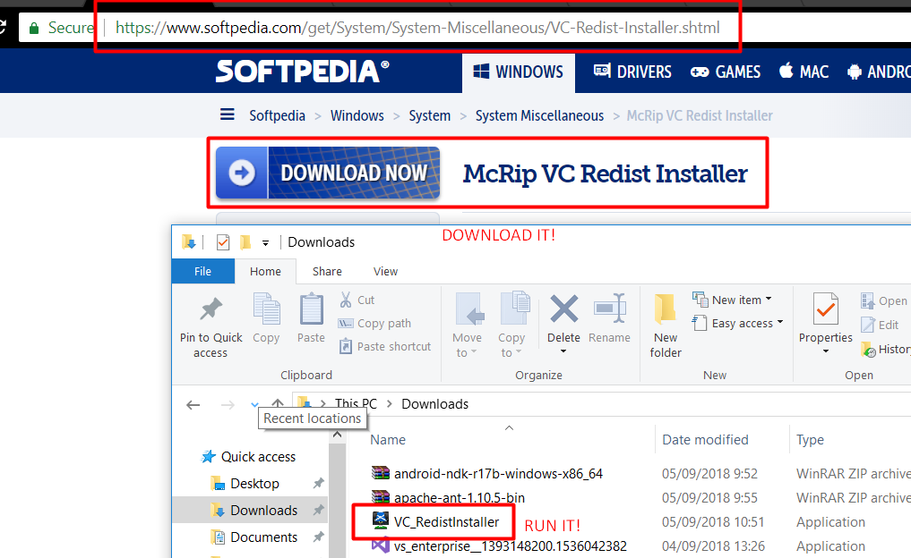
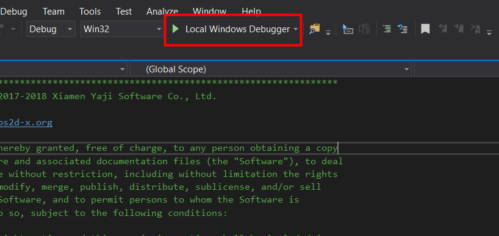

<h1>LANTELITE TUTORIAL</h1>
<h2>Cocos2dx + Visual Studio 2017</h2>
<h3 class="tips">Tips</h3>
<h3 class="fix_problem">Fix Problem</h3>
<h4 class="fix_problem">Missing MSVCR110.dll</h4>

1. Download and Install this app

2. Run the project again

<h2>InkScape</h2>
<h3 class="tips">Tips</h3>
<h3 class="fix_problem">Fix Problem</h3>
